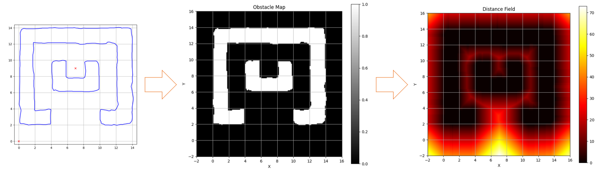
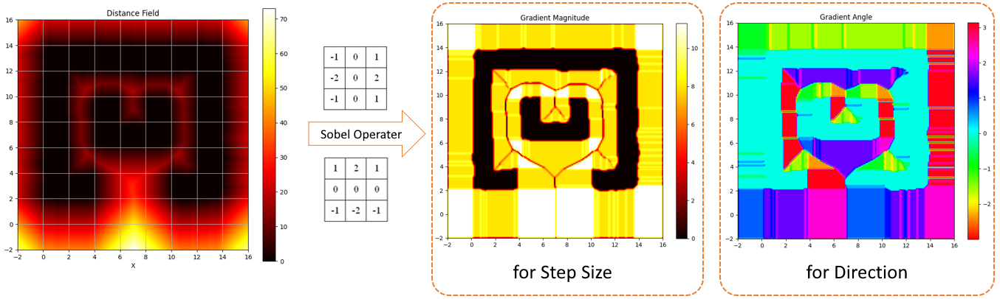
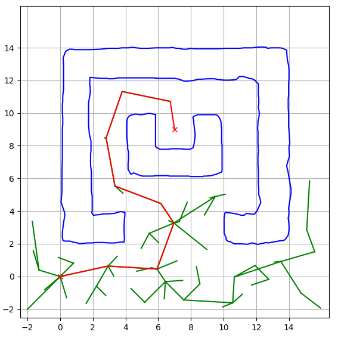
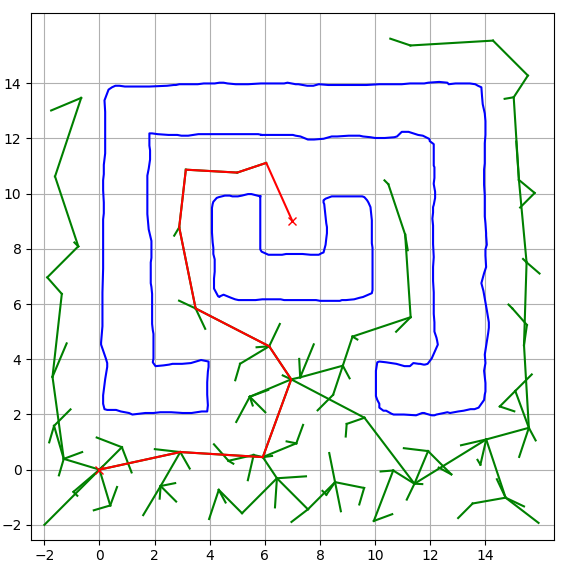

# ESDF-RRT

RRT Path Planner based on Euclidean Signed Distance Field (ESDF).

## Introduction

This project implements an RRT path planning algorithm combined with ESDF to accelerate collision detection. Compared to the traditional Shapely polygon-based collision detection method, the ESDF method achieves a **48x speedup**.

## Algorithm Flow

```
Path Planning → Obstacle Map → ESDF Distance Field → Gradient Calculation → RRT Path Planning
```

1. **Obstacle Map**: Rasterize polygon obstacles
2. **ESDF Distance Field**: Calculate distance from each grid cell to the nearest obstacle using BFS
3. **Gradient Calculation**: Use Sobel operator to compute gradient magnitude (step size) and gradient direction (steering)
4. **RRT Planning**: Efficient path search based on the gradient field

## Method Visualization

### ESDF Distance Field Generation



*Figure 1: Convert Obstacle Map to ESDFs Map for Collision Checking (Resolution: 0.1)*

### Gradient Field Calculation



*Figure 2: Calculate ESDFs Gradient Map for RRT Steering using Sobel Operator*

## Dependencies

- Python 3.x
- NumPy, Matplotlib, SciPy, Shapely

## Performance Comparison

| Collision Checking Method | Iteration Times | Total Time (sec) | Average Time Per Iteration (sec) |
|---------------------------|-----------------|------------------|----------------------------------|
| Shapely Polygon Based     | 212             | 0.147            | 6.91E-04                         |
| ESDF Based                | 418             | 0.006            | 1.44E-05 (48x faster)            |

### Path Planning Comparison

<table>
  <tr>
    <td align="center">
      
      <br>
      <b>Figure 3: Shapely Based RRT</b>
      <br>
      <i>Polygon-based Collision Checking</i>
    </td>
    <td align="center">
      
      <br>
      <b>Figure 4: ESDF Based RRT</b>
      <br>
      <i>48x Faster Collision Checking</i>
    </td>
  </tr>
</table>

## Acknowledgments

The RRT base implementation references the PythonRobotics project by [AtsushiSakai](https://github.com/AtsushiSakai).
